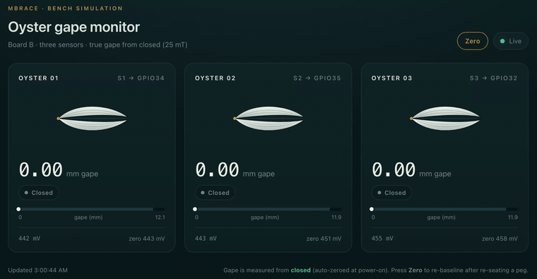

# Demo — bench simulation (25 mT + tare)

*Board B's live dashboard. Three clothespin "oysters," each with a HAL 2425 sensor
and a magnet on opposing jaws — the clothespin mouth is the shell gape. Each shell
on screen opens in proportion to the measured gape.*

## What the clip shows

- All three start **closed at 0.00 mm** ("Closed").
- Each peg is pressed open — the shell splays and the gape reads live in mm.
- Released back to closed → returns to **0.00 mm**. The per-unit **tare** holds the
  closed baseline, so closed is a true zero, not a fixed guess.

## Setup

- Firmware: [`firmware/06_board_b_tare`](../firmware/06_board_b_tare) on an ESP32-WROVER (Board B).
- Sensors S1/S2/S3 → GPIO34 / GPIO35 / GPIO32 (all ADC1, ÷1.5 front end).
- Linearized at **25 mT**, window **8.0–20.0** (see
  [`data/analysis/deployment_calibration.md`](../data/analysis/deployment_calibration.md)).
- **Per-unit tare:** `gape = (mV − baseline) / m`; the intercept cancels, so each unit
  reports true gape from its own closed baseline — the mechanism that generalizes across
  differently-mounted units.
- Dashboard gauge **auto-scales** to each unit's physical opening range.

## Full video

▶ **[Watch the full demo — Release v0.1-bench-demo](https://github.com/IamTemmy/Oyster_gape/releases/tag/v0.1-bench-demo)**
